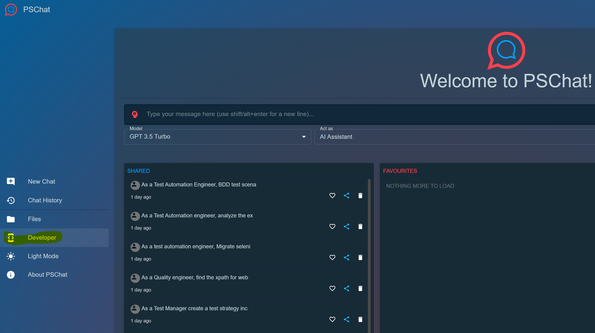
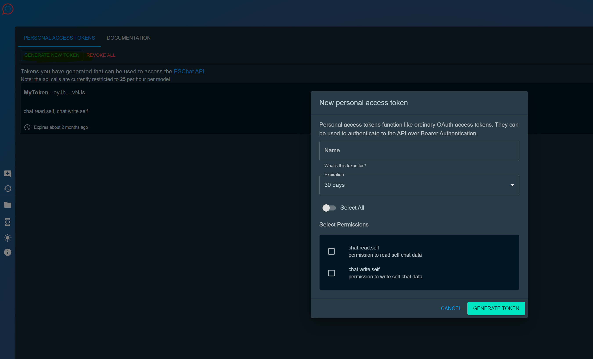

## setup
```
make setup
```

## steps to use Google LLM in local
1. Make sure setup is done
2. Use gcloud to authenticate ``` gcloud auth login ```
   

## Generating PS chat key
Visit PSchat dev section for generating the PS chat key. Refer to images below for details:





    
## Pre reads

### Mandatory reads for the session

#### 1. [Python 101](https://learnxinyminutes.com/docs/python)

#### 2. [Prompt Engineering for Engineers - on Marcel](https://learningmanagereu.adobe.com/app/learner?accountId=652#/course/1692950)

#### 3. [What is generative AI?](https://searchengineland.com/what-is-generative-ai-how-it-works-432402)

###### _These subtopics are optional_ - `How large language models are built` _and_ `How does a transformer predict text?`

### Recommended reads for the session

#### 4. [Brief about Deep Learning](https://towardsdatascience.com/simply-deep-learning-an-effortless-introduction-45591a1c4abb)

#### 5. [Langchain quick start](https://python.langchain.com/docs/get_started/quickstart)

#### 6. [A brief about embeddings](https://towardsdatascience.com/what-is-embedding-and-what-can-you-do-with-it-61ba7c05efd8)

#### 7. [RAG techniques](https://www.analyticsvidhya.com/blog/2023/09/retrieval-augmented-generation-rag-in-ai/)

#### 8. [LLM fine tuning example](https://www.datacamp.com/tutorial/fine-tuning-llama-2)
